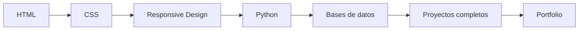

<p align="center">
  
</p>

<h1 align="center">Hola, soy Landev0</h1>

<h3 align="center">
  Estudiante de programación | Desarrollo web | Python | Bases de datos
</h3>

<p align="center">
  
</p>

<p align="center">
  
  
  
</p>

---

## Sobre mí

Estoy aprendiendo programación y construyendo mi camino como developer.

Actualmente me estoy dedicando al desarrollo de páginas web, practicando con HTML, CSS, Python y bases de datos. Me gusta crear proyectos simples para mejorar mi lógica, ordenar mi código y subir mis avances a GitHub.

- Aprendiendo desarrollo web desde cero.
- Practicando HTML, CSS y diseño de páginas.
- Mejorando mi lógica con Python.
- Explorando bases de datos y SQL.
- Creando proyectos para practicar y mostrar mi progreso.

---

## Tecnologías que estoy aprendiendo

<p align="center">
  
</p>

<p align="center">
  
  
  
  
  
</p>

---

## En qué estoy trabajando

```txt
HTML y CSS        Páginas web, estilos, estructura y responsive design
Python            Juegos, ejercicios, lógica y funciones
Bases de datos    SQL, tablas, consultas y organización de datos
GitHub            Repositorios, README y portfolio developer
```

---

## Proyectos que quiero crear

| Proyecto | Qué voy a practicar |
| --- | --- |
| Portfolio personal | HTML, CSS y presentación profesional |
| Página web estilo dark | Diseño visual y maquetación |
| Ta Te Ti en Python | Lógica, turnos y validaciones |
| Piedra, papel o tijera | Condicionales y funciones |
| Sistema con base de datos | SQL y manejo de información |

---

## Ruta de aprendizaje



---

## Mi estilo como developer

```python
class Landev0:
    def __init__(self):
        self.estado = "aprendiendo todos los dias"
        self.enfoque = ["web", "python", "bases de datos"]
        self.objetivo = "crear proyectos reales"

    def seguir_creciendo(self):
        return "practicar, crear, subir a GitHub y mejorar"
```

---

## Estadísticas

<p align="center">
  
  
</p>

---

## Próximos objetivos

- Crear mi página web personal.
- Mejorar mis proyectos con CSS.
- Aprender JavaScript más adelante.
- Crear programas más completos con Python.
- Practicar SQL con ejemplos reales.
- Subir proyectos con capturas y buenos README.

---

<p align="center">
  <strong>Gracias por visitar mi perfil.</strong>
</p>

<p align="center">
  <em>Estoy aprendiendo, practicando y construyendo mi camino como developer.</em>
</p>
